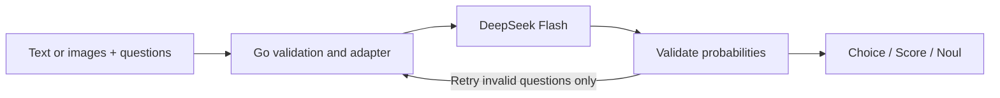

# dsk-jev

**A Jev-compatible decision API in Go, powered by DeepSeek — with image input.**

[中文](README.zh-CN.md) · [Detailed guide](docs/guide.zh-CN.md) · [Benchmarks](docs/benchmarks.md) · [Releases](https://github.com/windy/dsk-jev/releases)

Turn text or images into typed decisions: **Choice**, **Score**, and **Noul** (yes/no probability). Deploy your own small proxy, keep the decision interface, and inspect retries, cache usage and estimated costs.

Experimental software. Independent of TypeSafe and DeepSeek; does not run Jev weights. API compatibility does not imply equivalent predictions, calibrated confidence, speed or cost. Images are an extension to the text-only Jev protocol. Better complex reasoning is a research goal, not a demonstrated advantage.

## What works

- Text, structured state, and up to 8 images via public URLs or Base64.
- Choice (1–255 options), Score (2–10 levels), and Noul responses.
- Strict upstream tool calls with local probability validation.
- Up to 3 retries within a shared deadline; only failed questions are retried.
- Per-attempt token accounting, cache metrics, connection timings and optional JSONL usage records.
- One Go binary, no third-party Go modules. Thinking is disabled.



## Run in minutes

Bring a DeepSeek API key. Requests incur upstream API charges.

```sh
git clone https://github.com/windy/dsk-jev.git
cd dsk-jev
export PROXY_API_KEY='choose-a-local-client-key'
export DEEPSEEK_API_KEY='your-deepseek-key'
go run ./cmd/server
```

Requires Go 1.26.1 or newer. Alternatively download an experimental binary from [Releases](https://github.com/windy/dsk-jev/releases), verify `SHA256SUMS`, extract it and run `./dsk-jev` with the same environment variables. macOS binaries are not Apple-notarized.

Docker (no host Go installation needed):

```sh
docker build -t dsk-jev:local .
docker run --rm --name dsk-jev \
  -p 127.0.0.1:8080:8080 \
  -e PROXY_API_KEY -e DEEPSEEK_API_KEY \
  dsk-jev:local
```

In another terminal, export the same `PROXY_API_KEY` and try either fixture:

```sh
curl --fail-with-body http://127.0.0.1:8080/v1/systemone \
  -H "Authorization: Bearer $PROXY_API_KEY" \
  -H 'Content-Type: application/json' \
  --data-binary @examples/ticket.json

# The complete fixture embeds a small PNG; no image hosting required.
curl --fail-with-body http://127.0.0.1:8080/v1/systemone \
  -H "Authorization: Bearer $PROXY_API_KEY" \
  -H 'Content-Type: application/json' \
  --data-binary @examples/vision.json
```

## Request and response

```json
{
  "model": "jev-latest",
  "state": "The customer explicitly asks for a refund.",
  "questions": {
    "refund": {"type": "noul", "instructions": "Is a refund explicitly requested?"}
  }
}
```

Example response (probabilities and token counts vary):

```json
{
  "model": "jev-1.13.0",
  "answers": {"refund": {"type": "noul", "noul": 0.99}},
  "usage": {"input_tokens": 500, "output_tokens": 30}
}
```

For vision, add `"images": [{"url": "data:image/png;base64,...", "detail": "low"}]` to the request. Public HTTP(S) URLs also work. Images are forwarded as real multimodal content, not text URLs. `state` remains required and may be an empty string. The native TypeSafe SDK may not expose this extension; use HTTP JSON for images.


Image fixture: ask for the circle's color, the number of squares, or the total shape count. Limits: 8 images, 4 MiB total JSON body, 2 MiB decoded per inline image. PNG/JPEG/GIF/WebP; detail `auto`, `low`, `high` or `original`. The upstream downloads remote URLs; the proxy does not fetch them itself.

## Configuration and compatibility

See [.env.example](.env.example). The server **does not automatically load `.env`**. Defaults: localhost:8080, `deepseek-flash`, DeepSeek `/beta`, `MAX_RETRIES=3`, total `UPSTREAM_TIMEOUT=30s`.

| Interface | Behavior |
|---|---|
| `POST /v1/systemone` | Bearer-authenticated typed decisions |
| `GET /v1/models` | Compatibility model aliases |
| `GET /healthz` | Unauthenticated process health, not upstream readiness |
| `images` | Optional project extension; not native Jev |
| `usage` | Cumulative actual DeepSeek tokens across attempts, not Jev-equivalent tokens |
| Response `model` | Protocol alias; `X-Upstream-Model` identifies the configured backend |

`OUTPUT_MODE=standard` is the default. `fast` uses experimental compact probability arrays and sparse large-option output; it changes precision/model behavior. The plain-text protocol explored in research reports is **not implemented** in the service.

`USAGE_LEDGER_PATH` optionally enables append-only per-attempt JSONL records without input text or image URLs. Ledger failures are logged but do not block responses: this is observability, not a transactional billing system. Public-price estimates are not invoice amounts. No multi-tenant accounts, rate limiting, built-in TLS or result cache; do not expose an unprotected public endpoint.

## Evidence and development

Read the [main benchmark report](docs/benchmarks.md) for measured accuracy, latency, cache state, pricing and limitations. We do **not** claim to beat Jev on speed or cost. The small synthetic vision test validates connectivity and output handling, not production vision accuracy.

Offline checks (no provider key or paid requests):

```sh
go test -race ./...
go vet ./...
go build -o bin/dsk-jev ./cmd/server
python3 -m unittest discover -s scripts -p 'test_accounting.py'
python3.12 -m venv .venv
.venv/bin/pip install -r requirements-dev.txt
.venv/bin/python scripts/sdk_smoke.py
```

Real-provider evaluations are opt-in and incur costs; see the [detailed guide](docs/guide.zh-CN.md). CI runs only local mock tests. See [contributing](CONTRIBUTING.md), [security](SECURITY.md), and [changelog](CHANGELOG.md).

MIT licensed. Adapted confidence formulas retain their original attribution in [THIRD_PARTY_NOTICES](THIRD_PARTY_NOTICES).
